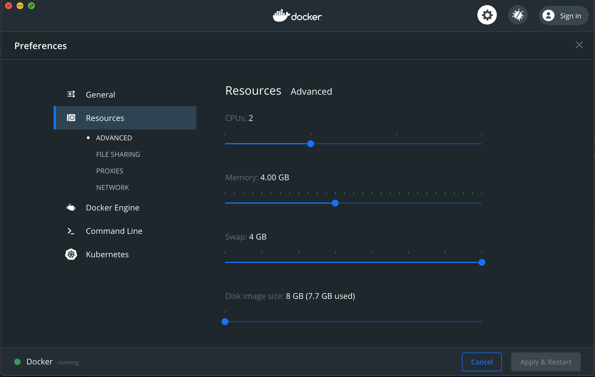

**Use one of the tags (i.e. `git checkout 0.3.3`) if you desire a stable release. Master breaks frequently.**

# kb toolchain

This is a toolchain built on top of [kind](https://github.com/kubernetes-sigs/kind) that aims to address the complexity associated with using it as a tool for microservice development. It was born out of necessity to reduce increasing execution times and maintenance overhead of bash scripts that accomplished more or less the same thing.

Currently, `kb` only builds locally using the Docker daemon. It is already a suitable replacement for `docker buildx build`. There are plans to support on-cluster building with [kaniko](https://github.com/GoogleContainerTools/kaniko).

At its core, the `kb.yaml` file defines how images are built and tested either locally or on Kubernetes. The build process is fully parallelized and utilizes caching, so as to bypass redundant work for each submodule when no files have changed.

The testing features are stable but currently lack documentation. To run tests on a kind cluster using the [local registry](https://kind.sigs.k8s.io/docs/user/local-registry/), use the command `kb test --kind my-cluster --repository localhost:5000`

### kb.yaml
```yaml
# Relative paths to any dependent modules. Building or
# testing this module will do the same for all deps.
# These are built/tested concurrently, so it can be more
# generally exploited to parallelize build jobs.
dependencies:
  - my-submodule # ./my-submodule/kb.yaml

build:
  # Name of the Docker image to build. The tag is chosen
  # by kb, so only specify repo and image.
  name: midcontinentcontrols/example-image

  #dockerfile: ./Dockerfile

  # Docker build context, relative to kb.yaml
  #context: .

  # https://docs.docker.com/engine/reference/commandline/build/
  #buildArgs:
  #  - name: ARG_NAME
  #    value: ARG_VALUE

  # Default builder will choose docker for building locally and
  # kaniko for on-cluster. For building architectures not supported
  # by kaniko (e.g. arm32) specifying `docker` here will mount the
  # node's docker.sock into the build pod and use that instead.
  # Note: if a builder preference of `docker` is enforced, invoking
  # `kb build --builder kaniko` will raise an error.
  #builder: "" # "docker", "kaniko"

  # Only schedule the builder pod on nodes with these labels.
  # In multiarch environments, this is useful for ensuring images
  # are built only on nodes with compatible architecture.
  #nodeSelector:
  # arm32: yes    # Schedule on nodes labeled with `kubectl label node my-node arm32=yes`

  # Commands to run locally before building
  #before: []

  # Commands to run locally after building/pushing
  #after: []

env:
  # Deploy the module using docker. This is currently
  # unimplemented, but in the future docker-compose
  # might be suppoted and can be configured here.
  # Note: `env.docker` is fully supported for tests,
  # where it will execute the test image locally.
  #docker: {}

  # Deploy the module to a kubernetes cluster.
  kubernetes:
    # List of relative paths to manifests that should be
    # applied at deploy.
    resources:
      - path/to/my_custom_resource_definitions.yaml
    # These are passed to `kubectl apply -f`, so directories
    # containing multiple yaml files are supported.
      - path/to/folder_containing_manifests/

    # These charts will be installed/upgraded at deploy.
    charts:
      kb: # Each item is given a name, which can be anything.
        releaseName: kb
        namespace: kb
        name: path/to/chart # Repository name or dir path that has ./path/to/chart/Chart.yaml
        values: {}

test:
  # Tests have a `build` section mirroring the module's.
  # Typically, this image will contain source code for all
  # the repo's dependencies and potentially be multiple gb
  # in size.
- build:
    name: midcontinentcontrols/example-test
    dockerfile: test/Dockerfile
  
  # We can specify a minimal environment for running the tests.
  # This section mirrors the root `env` section because a test
  # is effectively a module with an implicit manifest that
  # cannot be depended upon. 
  env:
    # Run the test image locally with Docker. This is useful
    # for incorporating unit tests into your kb.yaml
    #docker: {}

    # Run the test in a Kubernetes environment. The cluster
    # may be an actual k8s cluster or a KIND cluster running
    # either locally or inside a pod.
    kubernetes:
      # List of relative paths to manifests that should be
      # applied before running tests.
      resources:
        - path/to/my_custom_resource_definitions.yaml

      # These charts will be installed/upgraded before this
      # test runs. Note: the module's env is always updated
      # when tests run. This chart is only shown here for
      # demonstration purposes.
      charts:
        kb:
          releaseName: kb
          namespace: kb
          name: path/to/chart # ./path/to/chart/Chart.yaml
          values: {}

    # If your tests take a long time to complete, here
    # you can specify a default value for the --timeout
    # flag of `kb test`.
    defaultTimeout: 5m
    
    # List of environment variables that will be passed to
    # the test container.
    variables:
      - name: EXAMPLE_DEPENDENCY_URI
        value: http://example-dependency-microservice.default.svc.cluster.local:5000
```

## Test Environments
The minimal environment required by the tests is configured under the `test.env:` section of `kb.yaml`. 

### Docker
For tests that do not *require* Kubernetes (e.g. unit tests), there is Docker executor that runs the test image in isolation: 

```yaml
# kb.yaml
test:
  build:
    # Name of the test image. This image is not pushed unless
    # necessary, so you can use whatever you want.
    name: midcontinentcontrols/example-test-image

    # Custom dockerfile path typically has to be assigned
    # for tests, as it defaults to ./Dockerfile. The build
    # context will be the root and includes ./test/Dockerfile
    dockerfile: test/Dockerfile

  env:
    # Run tests in a simple Docker container. Note: if no
    # additional settings are required, the empty object
    # `{}` is used to make the field non-nil
    docker: {}

  # Environment variables passed to the test container
  #variables:
  #- name: FOO
  #  value: BAR
```

Note that tests using the Docker environment can still run as pods on Kubernetes, but they will not have access to the cluster.

### Kubernetes
Tests requiring a Kubernetes cluster can indicate the minimal requirements by defining the `test.env.kubernetes:` object. If a chart or resource is part of a module's standard deployment, it should be included in the module's root `env:` section, as opposed to a test. This is so you can use `kb deploy` in a production settings, i.e. when you want to install/upgrade a chart without running the tests.

```yaml
# kb.yaml
env:
  kubernetes: {} # Put production k8s configuration here

test:
  ...
  env:
    # Run these tests on kubernetes. This test environment
    # will only be considered during development, and not
    # during a production deploy.
    kubernetes:
      # Paths to resources that will be applied every time
      # before running tests. Use this to load CRDs and
      # secrets. Remember to add your secrets to .gitignore
      # so they are not checked into source control.
      resources:
        - crds/
        - test/fixtures/
        - test/fixtures/secrets/

      # These charts will be installed/upgraded before the
      # tests run.
      charts:
        kb:
          releaseName: kb
          name: ./charts/kb # ./charts/kb/Chart.yaml
          values: {}
```

The test container will now run as a pod on Kubernetes with cluster admin privileges. Any setup necessary for your tests, such as applying manifests or syncing helm charts, should go in `test.env.kubernetes`. If you require additional features to prepare your test environment, please [open an issue](https://github.com/midcontinentcontrols/kb/issues).

## Docker Desktop Gotchas
### Resource Limits
**The default resource limits for some Docker Desktop backends, e.g. Hyper-V, are insufficient to run the tests.** If this occurs, you will encounter [kind#1437](https://github.com/kubernetes-sigs/kind/issues/1437#issuecomment-602975739). Configure Docker with 4gb of both memory and swap just to be safe:


### kb isn't using any push credentials!
Check your `$HOME/.docker/config.json` and remove the line that has `"credsStore": "desktop"`, then re-login to Docker. Your credentials will be stored directly in `config.json` and kb will be able to use them.

## Security
Running kind in a Kubernetes pod poses security risks worthy of operator attention. The Docker daemon of the node, running as root, is exposed to the test cluster. This is considered acceptable when running trusted code on dedicated hardware, which is the target use case of kb. Open source developers in particular should consider the risks of using kb with their community CI, and take appropriate mitigating measures.

Even when not using kind, test pods always run with cluster admin permissions. This may change in the future, but for now the goal is to keep things simple.

## Contributing
Please open an issue or [send an email](mailto:thavlik@midcontinentcontrols.com) if you would like to contribute or offer feedback. 

### Running the Tests
The unit tests aim to be comprehensive. To run them with full console output:
```
git clone git@github.com:midcontinentcontrols/kb.git
cd kb/pkg/kb
go test -v -timeout 4h
```
Image pulling and building is part of the tests, making the `-timeout` flag necessary. `.vscode/settings.json` is intentionally part of this repository in order for VS Code's `Go: Toggle Test Coverage in Current Package` to work correctly.

## License
Copyright (c) Mid Continent Controls, Inc. 2023

Released under MIT and Apache dual licenses. Unencumbered commercial use is permitted. See LICENSE-Apache and LICENSE-MIT files for more information.
